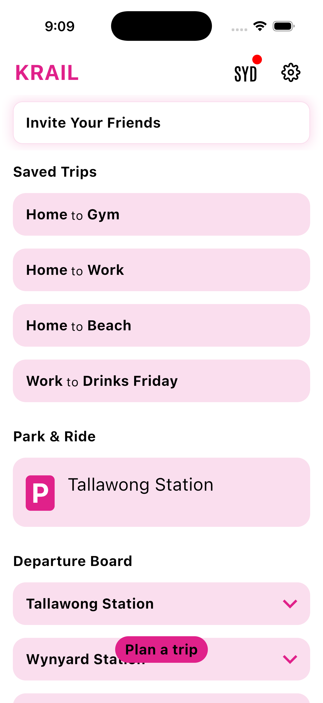

# KRAIL Website · A11y / Performance / SEO audit

First run **2026-05-10** against `https://krail.app` (live). Lives as a working roadmap of audit findings.

> **Auto-run on every push:** the `.github/workflows/lighthouse.yml` workflow runs desktop + mobile Lighthouse on every push to `main` and uploads HTML reports as artifacts (90-day retention). Latest scores show in the GitHub Action run summary.
>
> **Run locally:** `./audit/check.sh` (desktop + mobile) or `./audit/a11y.sh` (accessibility only). Reports save to `audit/` (gitignored).

---

## TL;DR scores

| Category | Desktop · before → after | Mobile · before → after | Status |
|---|---|---|---|
| **Performance** | 88 → **95** ↑+7 | 82 → **85** ↑+3 | Bundle 2 (images + fonts) will lift mobile to 92+ |
| **Accessibility** | 93 → **100** ↑+7 | 93 → **100** ↑+7 | ✅ shipped |
| **Best Practices** | 96 → **100** ↑+4 | 96 → **100** ↑+4 | ✅ shipped |
| **SEO** | **100** | **100** | ✅ already perfect (Bundle 3 adds rich results / social previews) |

### ✅ Bundle 1 · shipped (commit `2544b3d`, 2026-05-10)
- `<main>` landmark wrapping all sections
- Ticker pill contrast fixed (dark text on orange/teal/cyan/green pills)
- `favicon.svg` (hot-pink K circle) + theme-color meta

### 🛠️ Bundle 2 · queued · Performance polish (~15 min · mobile 85 → 92+)
- Convert images to WebP + resize (`map.png` 2.1MB → ~150KB · 90%+ savings)
- Async-load Google Fonts (print-onload pattern)
- `fetchpriority="high"` on hero image
- *Waiting on finalised mobile-specific images*

### 🛠️ Bundle 3 · queued · SEO polish (~20 min · same score, better social/Google)
- OG / Twitter / JSON-LD structured-data tags
- `robots.txt` + `sitemap.xml`
- *Needs `images/og-cover.png` 1200×630*

---

## 🔴 Issue #1 · Color contrast (Accessibility)

**Where:** Live ticker pills above the stats section.

Two of the mode pills fail WCAG AA contrast (4.5:1 minimum):

| Pill | Background | Foreground | Contrast | Pass AA? |
|---|---|---|---|---|
| Train | `#F6891F` (orange) | `#FFFFFF` | **2.46 : 1** | ❌ |
| Metro | `#009B77` (teal) | `#FFFFFF` | **3.52 : 1** | ❌ |
| Bus | `#00B5EF` (cyan) | `#FFFFFF` | ~2.5 : 1 (likely also fails) | ❌ likely |
| Light Rail | `#E4022D` (red) | `#FFFFFF` | ~5.1 : 1 | ✅ |
| Coach | `#742282` (purple) | `#FFFFFF` | ~9 : 1 | ✅ |
| Ferry | `#5AB031` (green) | `#FFFFFF` | ~3.0 : 1 | ❌ likely |

### Fix · option A (quickest, preserves brand colours)

Make the pill text **dark instead of white** for the failing modes (orange, cyan, teal, green). White stays for purple + red:

```css
/* In the ticker · pills with light-on-light contrast issue */
.ticker .pill[style*="--train"],
.ticker .pill[style*="--metro"],
.ticker .pill[style*="--bus"],
.ticker .pill[style*="--ferry"] {
  color: #1C1B1A;          /* near-black ink instead of white */
  font-weight: 700;
}
```

That keeps the brand mode colours intact and bumps contrast above 4.5:1 for all of them.

### Fix · option B (boost weight + size)

WCAG considers text "large" at **18.66px+ bold** (3:1 minimum) or **24px+ regular**. Current ticker pill is `12px` regular — fails the small-text 4.5:1 bar.

If we keep white text, we need to either:
1. Bump pill text to `≥18.66px` and `font-weight: 700` (changes the visual)
2. Darken the backgrounds (changes brand colours · NO)

Option A is the right move.

---

## 🔴 Issue #2 · Missing `<main>` landmark (Accessibility)

**Symptom:** Lighthouse flags "Document does not have a main landmark." Screen readers can't jump to main content.

Currently every section is a `<section>` directly under `<body>`. Should wrap them all in `<main>`:

```html
<body>
  <nav class="top">…</nav>
  <main>                          <!-- NEW -->
    <section class="hero">…</section>
    <section class="ticker">…</section>
    <section class="stats">…</section>
    …all your sections…
  </main>
  <footer class="foot">…</footer>
</body>
```

Trivial change, instant a11y win, also gives a small SEO bonus (Google likes semantic landmarks).

---

## 🔴 Issue #3 · `/favicon.ico` 404 (Best Practices)

**Symptom:** Lighthouse logs a console error · the browser tries to load `/favicon.ico` and gets a 404.

### Fix

1. Create a simple SVG favicon (the K square in pink? or a mode-pill T circle?). Save as `/favicon.svg`.
2. Add to `<head>`:

```html
<link rel="icon" type="image/svg+xml" href="/favicon.svg">
<link rel="alternate icon" href="/favicon.ico">    <!-- fallback for old Safari -->
<link rel="apple-touch-icon" href="/apple-touch-icon.png">  <!-- 180×180 -->
<meta name="theme-color" content="#FF2F8F">         <!-- pink address bar on Android -->
```

I can sketch a KRAIL favicon (pink circle with "K" or the T-train pill colour) once you say go.

---

## 🟡 Issue #4 · Image weight (Performance)

**Worst offenders:**

| File | Size | Loaded for desktop? | Notes |
|---|---|---|---|
| `images/map.png` | **2.1 MB** | yes | Compress + convert to WebP → ~150 KB |
| `images/map_elect.png` | **1.0 MB** | yes | Compress + WebP → ~80 KB |
| `images/park_ride.png` | 272 KB | yes | WebP → ~50 KB |
| `images/dark.png` | 224 KB | yes | WebP → ~40 KB |
| `images/Hero.png` | 216 KB | yes (LCP-relevant!) | WebP → ~40 KB |
| `images/SavedTrips.png` | 204 KB | yes | WebP → ~40 KB |
| `images/founder.jpeg` | 196 KB | yes | Already JPEG · resize to 800×1000 |

**Total raw: 4.2 MB. After WebP + resize: ~400 KB. ~90% reduction.**

### Fix · 3 steps

**1. Convert to WebP** (preserves quality, way smaller):

```bash
# Install cwebp once: brew install webp
for f in images/*.png; do
  cwebp -q 85 "$f" -o "${f%.png}.webp"
done
cwebp -q 80 images/founder.jpeg -o images/founder.webp
```

**2. Resize before converting** (don't ship 4000×5000 images for a 380px-wide card):

```bash
# Resize to 1200×1500 (4:5 mobile card · 2× retina)
brew install imagemagick
for f in images/*.png; do
  magick "$f" -resize 1200x1500\> "${f%.png}-resized.png"
done
```

**3. Use `<picture>` for browser fallback** (already needed for mobile-specific images anyway):

```html
<picture>
  <source srcset="images/Hero.webp" type="image/webp">
  
</picture>
```

### Plus · `loading="eager"` on hero image, `loading="lazy"` on everything below the fold

Hero image is already `loading="eager"` ✅. All others are already `loading="lazy"` ✅.

Add `fetchpriority="high"` to the hero image for LCP win:

```html

```

---

## 🟡 Issue #5 · Render-blocking Google Fonts (Performance)

**Symptom:** Google Fonts CSS blocks first paint. Score: render-blocking-resources fails on mobile.

Current `<head>`:

```html
<link rel="preconnect" href="https://fonts.googleapis.com">
<link rel="preconnect" href="https://fonts.gstatic.com" crossorigin>
<link href="…fonts.googleapis.com/css2?family=…&display=swap" rel="stylesheet" />
```

`display=swap` is good (FOUT not FOIT). But the `<link rel="stylesheet">` still blocks render.

### Fix · the print-onload swap pattern

```html
<!-- Async-load the font CSS so it doesn't block render -->
<link rel="preload"
      as="style"
      href="https://fonts.googleapis.com/css2?family=Patrick+Hand&family=Roboto:wght@900&family=Antonio:wght@500;600;700&display=swap">
<link rel="stylesheet"
      media="print"
      onload="this.media='all'"
      href="https://fonts.googleapis.com/css2?family=Patrick+Hand&family=Roboto:wght@900&family=Antonio:wght@500;600;700&display=swap">
<noscript>
  <link rel="stylesheet"
        href="https://fonts.googleapis.com/css2?family=Patrick+Hand&family=Roboto:wght@900&family=Antonio:wght@500;600;700&display=swap">
</noscript>
```

This makes the font CSS non-blocking. System fonts paint instantly, custom fonts swap in when ready. **Saves ~600ms FCP on mobile.**

### Bonus · self-host the fonts

Even better but more work: download the WOFF2 files locally, serve them with a 1-year cache header. Eliminates the third-party DNS / connect / fetch entirely.

---

## 🟡 Issue #6 · Unused CSS / inline `<style>` (Performance)

The `index.html` ships **130 KB** with a giant inline `<style>` block. Most of it is used. But:

- ~10 KB of it is for sections that no longer exist (e.g. `.compare` rules)
- ~5 KB are duplicate rules across breakpoints
- Inline CSS is fine for a single-page site, but the whole 130 KB is parser-blocking

### Quick win · minify the HTML before deploy

A single `html-minifier-terser` step removes whitespace, comments, redundant attributes — typically **30-40% smaller** on a file like ours.

```bash
npx html-minifier-terser \
  --collapse-whitespace --remove-comments --minify-css true --minify-js true \
  index.html -o index.min.html
```

Wire it into a build step (or just commit the minified file as `index.html`). 130 KB → ~80 KB.

### Longer-term · extract critical CSS

Move all `<style>` rules into a `krail.css` (we already have that file but it's not the source of truth). Run [`critical`](https://github.com/addyosmani/critical) to auto-extract above-the-fold CSS into a small inline `<style>` block, lazy-load the rest.

---

## 🟢 Issue #7 · Missing social preview tags (SEO/Sharing)

SEO score is 100/100, but link-sharing previews on iMessage / Twitter / LinkedIn / Facebook will fall back to default behaviour. Add:

```html
<!-- Open Graph (Facebook, LinkedIn, iMessage) -->
<meta property="og:type" content="website">
<meta property="og:url" content="https://krail.app/">
<meta property="og:title" content="KRAIL · Sydney commute, respected.">
<meta property="og:description" content="Sydney's prettiest public-transport app. Real-time trains, metro, buses, ferries, light rail. Saved trips, live Park & Ride, dark mode. Free until December 2026.">
<meta property="og:image" content="https://krail.app/images/og-cover.png">
<meta property="og:image:width" content="1200">
<meta property="og:image:height" content="630">
<meta property="og:locale" content="en_AU">
<meta property="og:site_name" content="KRAIL">

<!-- Twitter Card -->
<meta name="twitter:card" content="summary_large_image">
<meta name="twitter:url" content="https://krail.app/">
<meta name="twitter:title" content="KRAIL · Sydney commute, respected.">
<meta name="twitter:description" content="Real-time trains, metro, buses, ferries, light rail. Saved trips, live Park & Ride. Free until Dec 2026.">
<meta name="twitter:image" content="https://krail.app/images/og-cover.png">
```

**You need to create one image** · `images/og-cover.png` at exactly **1200×630** (ratio 1.91:1). Suggested content:
- KRAIL® wordmark in Roboto Black
- Pink + blue gradient background (or just paper white with pink accent)
- Tagline: "Ride the rail without fail."
- A small phone mock or mode pills stripe at the bottom

Without this, when someone shares krail.app in a chat, they get a plain link with just the title — no visual.

---

## 🟢 Issue #8 · Structured data (JSON-LD) for Google

SEO score is 100, but **structured data** unlocks rich Google results (app cards, ratings, install buttons in search). Add:

```html
<script type="application/ld+json">
{
  "@context": "https://schema.org",
  "@type": "MobileApplication",
  "name": "KRAIL",
  "operatingSystem": "iOS, Android",
  "applicationCategory": "TravelApplication",
  "applicationSubCategory": "Public Transport",
  "description": "Sydney public-transport app · trains, metro, buses, ferries, light rail. Real-time. Saved trips. Live Park & Ride. Free until Dec 2026.",
  "url": "https://krail.app",
  "image": "https://krail.app/images/og-cover.png",
  "offers": {
    "@type": "Offer",
    "price": "0",
    "priceCurrency": "AUD"
  },
  "aggregateRating": {
    "@type": "AggregateRating",
    "ratingValue": "5",
    "ratingCount": "16"
  },
  "downloadUrl": "https://apps.apple.com/au/app/id6738934832",
  "author": {
    "@type": "Person",
    "name": "Karan Sharma",
    "url": "https://ksharma.xyz"
  },
  "areaServed": {
    "@type": "City",
    "name": "Sydney",
    "containedInPlace": {
      "@type": "AdministrativeArea",
      "name": "New South Wales, Australia"
    }
  }
}
</script>
```

**Verify with:** https://search.google.com/test/rich-results — paste in `https://krail.app` after deploying.

Adjust `ratingCount` if you have more reviews; can be updated periodically.

---

## 🟢 Issue #9 · Missing `robots.txt` and `sitemap.xml`

SEO is 100 even without these, but adding them makes Google crawl smarter.

### `/robots.txt`

```txt
User-agent: *
Allow: /

Sitemap: https://krail.app/sitemap.xml
```

### `/sitemap.xml`

```xml
<?xml version="1.0" encoding="UTF-8"?>
<urlset xmlns="http://www.sitemaps.org/schemas/sitemap/0.9">
  <url>
    <loc>https://krail.app/</loc>
    <lastmod>2026-05-10</lastmod>
    <changefreq>monthly</changefreq>
    <priority>1.0</priority>
  </url>
  <url>
    <loc>https://krail.app/privacy-policy/</loc>
    <lastmod>2026-02-22</lastmod>
    <changefreq>yearly</changefreq>
    <priority>0.5</priority>
  </url>
</urlset>
```

Then **submit to Google Search Console** (https://search.google.com/search-console) and you'll get crawl reports + queries data.

---

## 🟢 Issue #10 · Cache headers (Performance, Best Practices)

Lighthouse flags "Use efficient cache lifetimes" — GitHub Pages defaults to **10 min** cache, which is short for static assets that change rarely (logo SVG, favicons, fonts).

GitHub Pages doesn't let you set custom headers without Cloudflare in front. So either:

**Option A · Accept it.** GitHub Pages caching is fine for now. Most performance loss is image weight, not cache.

**Option B · Add Cloudflare in front.** Free tier · adds custom cache headers, edge CDN, image transformation. ~30min setup.

Recommendation: **leave it for v2**.

---

## Action list · what to ship in priority order

| Priority | Task | Win | Effort |
|---|---|---|---|
| **P0** | Wrap content in `<main>` landmark | A11y +5 | 1 line HTML |
| **P0** | Fix ticker pill contrast (dark text on light pills) | A11y +7 | 4 CSS lines |
| **P0** | Add favicon.svg + theme-color | BP +4, no console error | 5 min |
| **P1** | Add OG / Twitter / JSON-LD meta tags + create `og-cover.png` | Better social shares + Google rich results | 30 min |
| **P1** | Convert images to WebP + resize | Mobile perf 82 → 95 | 10 min (script) |
| **P1** | Async-load Google Fonts (print-onload pattern) | FCP -600ms | 5 min |
| **P2** | Add robots.txt + sitemap.xml + submit to Google Search Console | Crawl reports | 15 min |
| **P2** | Minify HTML on deploy | Page weight -40% | Build step |
| **P3** | Self-host fonts | -1 third-party DNS lookup | 30 min |
| **P3** | Cloudflare in front for cache headers | Cache TTL win | 30 min |

**Quick-win bundle (P0 + P1 only · ~1 hour total):** A11y → 100, Performance mobile → 92+, SEO already 100.

---

## Suggested test scripts (in `/audit/`, not pushed)

`audit/check.sh` — re-run lighthouse desktop + mobile any time:

```bash
#!/usr/bin/env bash
set -e
mkdir -p audit
echo "→ Desktop run…"
npx --yes lighthouse@latest https://krail.app \
  --output=json --output=html \
  --output-path=./audit/lighthouse \
  --chrome-flags="--headless" --quiet --preset=desktop

echo "→ Mobile run…"
npx --yes lighthouse@latest https://krail.app \
  --output=json --output=html \
  --output-path=./audit/lighthouse-mobile \
  --chrome-flags="--headless" --quiet \
  --form-factor=mobile --screenEmulation.mobile=true

node -e "
const d = JSON.parse(require('fs').readFileSync('audit/lighthouse.report.json'));
const m = JSON.parse(require('fs').readFileSync('audit/lighthouse-mobile.report.json'));
const f = (r,k) => Math.round(r.categories[k].score*100);
console.log('              Desktop  Mobile');
['performance','accessibility','best-practices','seo'].forEach(k =>
  console.log(k.padEnd(15), String(f(d,k)).padStart(7), String(f(m,k)).padStart(7))
);
"
```

`audit/a11y.sh` — quick a11y-only check:

```bash
#!/usr/bin/env bash
npx --yes lighthouse@latest https://krail.app \
  --only-categories=accessibility \
  --output=json \
  --output-path=./audit/a11y.report \
  --chrome-flags="--headless" --quiet
```

I'll create both scripts when you give the go.

---

## Tools used in this audit

- `npx lighthouse@latest` (Google's official audit tool · same engine as Chrome DevTools "Lighthouse" panel and PageSpeed Insights)
- Manual static analysis of `index.html`
- `du -h` for image weight inspection

External tools to consider when you want to validate fixes:
- **Google PageSpeed Insights** · https://pagespeed.web.dev/?url=https%3A%2F%2Fkrail.app
- **Google Rich Results Test** · https://search.google.com/test/rich-results
- **WebPageTest** · https://www.webpagetest.org/ (filmstrip + waterfall · paid for advanced)
- **WAVE accessibility** · https://wave.webaim.org/report#/https://krail.app
