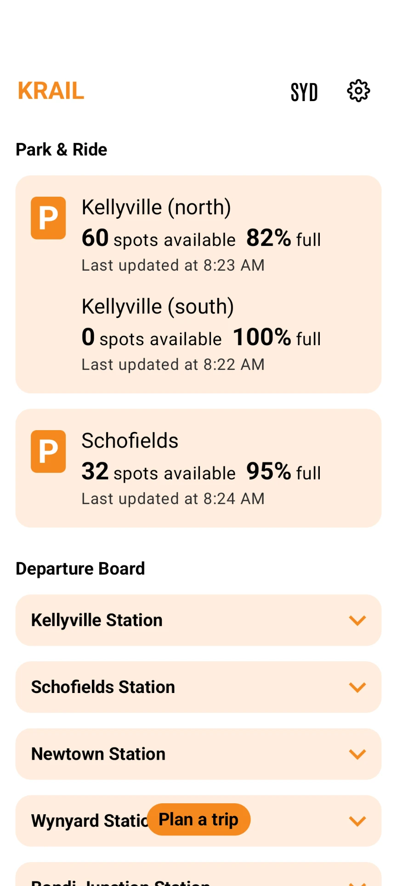

# KRAIL Website — design system & styling reference

The locked-in styling decisions from build sessions. Read alongside
`CLAUDE.md` (which covers brand/copy/IP rules). When in doubt, match
this doc — these have been iterated on, rejected, replaced, and
re-validated.

---

## Tokens

### Surface palette

```css
--paper:      #FFFFFF;       /* page background base */
--ink:        #1C1B1A;       /* primary text colour */
--ink-2:      #2E2E2E;       /* secondary text */
--muted:      #6B6157;       /* tertiary / quiet text */
--line:       rgba(28,27,26,0.10);
--warm-dark:  #2A211A;       /* phone bezel only — NOT footer anymore */
```

### Brand

```css
--brand-blue:    #1ADBFF;    /* electric cyan */
--brand-blue-2:  #38B6FF;
--brand-pink:    #FF2F8F;    /* hot magenta-pink */
--brand-pink-2:  #FF66B5;
--brand-purple:  #D634FF;    /* vivid orchid bridge */

--brand-grad: linear-gradient(95deg,
  var(--brand-blue) 0%,
  var(--brand-purple) 55%,
  var(--brand-pink) 100%);
```

### Mode colours (Sydney transport network — never override)

```css
--train: #F6891F;     /* orange */
--metro: #009B77;     /* teal-green */
--bus:   #00B5EF;     /* sky-blue */
--ferry: #5AB031;     /* leaf-green */
--lr:    #E4022D;     /* light-rail red */
--coach: #742282;     /* purple */
```

### Footer-specific

```css
footer.foot { background: #0B0B0D; }   /* near-black, NOT warm-dark */
```

### Sunset CTA gradient

```css
--brand-grad-vert: linear-gradient(180deg,
  #82DEF0 0%,
  #8AAEEC 22%,
  #B58CE5 48%,
  #ED8FB5 74%,
  #EFB07F 100%);
```

(soft watercolor sunset → dawn — no neon)

---

## Typography

```css
--sans:    -apple-system, BlinkMacSystemFont, "Segoe UI", Roboto, sans-serif;
--display: var(--sans);                   /* same family, treated different */
--antonio: "Antonio";                     /* in-phone mode pills, line codes */
--roboto-black: "Roboto" 900;             /* KRAIL wordmark only */
```

**Patrick Hand was rejected** (kiddish). Don't reintroduce hand-written
fonts. All "personal" feel should come from italic weight in system
display, not from a hand font.

### Typographic scale (key elements)

| Element | Family | Weight | Size | Style |
|---|---|---|---|---|
| `KRAIL` wordmark | `--roboto-black` | 900 | 24px | tight letter-spacing |
| Hero greeting `Hello Sydney,` | `--display` | 400 italic | clamp 24–32px | muted colour |
| H1 hero `Where are you going today?` | `--display` | 400 | clamp 42–78px | charcoal `#3A3A3A` |
| `today?` accent | inline `<em>` | 600 italic | inherit | brand pink + squiggle |
| H2 section title | `--display` | 800 | clamp 36–76px | `var(--ink)` |
| Section h2 `<em>` | inline | 800 italic | inherit | `var(--accent)` + squiggle |
| Feature h3 | `--display` | 800 | clamp 30–52px | `var(--ink)` |
| Feature h3 `<em>` | inline | 800 italic | inherit | `var(--accent)` + squiggle |
| Eyebrow | `--sans` | 800 | 12px | uppercase, `2px` tracking, `var(--accent)` |
| Body text | `--sans` | 400 | 16–17px | `var(--ink-2)` |
| Stamp button label | `--display` | 700 italic | 15–18px | high contrast |
| Footer `LET'S KRAIL` | `--display` | 800 italic | clamp 48–112px | animated rainbow + sheen |

**Headlines should be SOLID colour, never gradient-clipped.**
Gradient-clipped text was tried on stat numbers, h2 ems, mini-top
wordmark — all rejected for "everything pink/blue gradient". Solid
colour with the marker squiggle as the only accent treatment.

---

## Per-section accent colour rotation

Each section sets `--accent` on its container so eyebrow line +
heading em + squiggle + chip colours all inherit consistently. The
rotation prevents pink-everywhere fatigue.

| Section | Accent |
|---|---|
| Hero (`today?`) | `var(--brand-pink)` (default) |
| Stats `Sydney, end to end.` | `var(--bus)` |
| Features intro `Less tapping. More moving.` | `var(--metro)` |
| Saved Trips block | `#E0218A` (barbie pink) |
| Park & Ride block | `var(--train)` |
| Map view block | `var(--metro)` |
| Real-time block | `var(--bus)` |
| Testimonials `swapping over.` | `var(--ferry)` |
| Founder `wrong platform.` | `var(--coach)` |
| Email callout `hello?` | `var(--brand-pink)` |
| FAQ `everyone asks.` | `var(--lr)` |

Apply via inline `style="--accent: var(--metro);"` on the section /
block / heading parent.

---

## Visual signatures

### Squiggle marker underline

Hand-drawn sine-wave SVG dropped under any italic `<em>` accent word.
Two overlaid paths for a marker-pen feel.

```html
<em>accent word.<svg class="sq-line" viewBox="0 0 100 10" preserveAspectRatio="none" aria-hidden="true">
  <path class="stroke-bold" d="M0 5 Q 5 0 10 5 T 20 5 T 30 5 T 40 5 T 50 5 T 60 5 T 70 5 T 80 5 T 90 5 T 100 5"/>
  <path class="stroke-thin" d="M0 5 Q 5 0 10 5 T 20 5 T 30 5 T 40 5 T 50 5 T 60 5 T 70 5 T 80 5 T 90 5 T 100 5"/>
</svg></em>
```

```css
.sq-line {
  position: absolute;
  left: -3px; right: -3px;
  bottom: -10px;
  width: calc(100% + 6px);
  height: 14px;
  pointer-events: none;
  overflow: visible;
  color: var(--accent, var(--brand-pink));
  transform: rotate(-0.6deg);
}
.sq-line .stroke-bold,
.sq-line .stroke-thin {
  fill: none;
  stroke: currentColor;
  stroke-linecap: round;
  stroke-linejoin: round;
  stroke-dasharray: 240;
  stroke-dashoffset: 240;
  transition: stroke-dashoffset 1.5s cubic-bezier(.5, .05, .15, 1) .12s;
}
.sq-line .stroke-bold { stroke-width: 5.5; opacity: 0.55; }
.sq-line .stroke-thin { stroke-width: 2.5; opacity: 1; transition-delay: .25s; }

/* Triggers on viewport entry */
.anim.in .sq-line .stroke-bold,
.anim.in .sq-line .stroke-thin,
.feature-block.in .sq-line .stroke-bold,
.feature-block.in .sq-line .stroke-thin {
  stroke-dashoffset: 0;
}
```

The em parent **must be `position: relative; display: inline-block`**
so the absolute SVG positions correctly. If a new accent word is
added, also add the SVG inside.

### Stamp button (the universal button pattern)

Used for: nav `Get the app`, store buttons (hero + CTA), email pill,
social stamps, hero eyebrow chip.

```css
button {
  background: var(--ink);
  color: #fff;
  border: 2px solid var(--ink);
  border-radius: 0;                /* sharp corners */
  padding: 14px 22px;
  font-family: var(--display);
  font-style: italic;
  font-weight: 700;
  cursor: pointer;
  transition: transform .22s cubic-bezier(.2,.7,.3,1), box-shadow .22s ease, background .2s ease;
}
button:hover {
  transform: translate(-3px, -3px);
  background: #000;
  box-shadow: 6px 6px 0 var(--brand-pink);    /* or var(--accent) per section */
}
button:active {
  transform: translate(0, 0);
  box-shadow: 3px 3px 0 var(--brand-pink);
}
```

**Liquid-glass / blur halo / glow buttons were tried and rejected**
("looks yuck"). Never use `backdrop-filter: blur` on buttons.
**Sharp corners only** (no `border-radius` rounding).

### Body blob layer (single, continuous)

ONE radial-gradient layer on `<body>` with 11 stops at percentage
positions. Sections are transparent. Per-section `::before` pseudo
blobs were tried and rejected (created visible seams between sections).

```css
body {
  background:
    radial-gradient(820px 680px at 8% 4%,   rgba(47,217,255,0.22), transparent 65%),
    radial-gradient(820px 680px at 92% 8%,  rgba(255,90,168,0.20), transparent 65%),
    /* ...11 stops total */
    var(--paper);
}
```

Opacity range `0.16–0.22`. Pink + blue ambient mist, not dominant.

### Hero floating mode icons

Six full-alpha mode pills (T M B F L C) drift around the hero with
gentle float keyframes. Always `opacity: 1` (never dimmed). City-panel
imagery (skyline SVG behind phone) was tried and removed — the phone
stands alone.

Position rules: stay clear of the H1 reading zone (`left: 4–22%` rows
20–60% are forbidden). Safe slots:
- Top right column above phone (`top: 4%, left: 54%`)
- Far-left edge peek (`left: 0–2%`)
- Around the phone in the right column

---

## Footer signature

### Layout flow (top-to-bottom)

```
[ rainbow strip — 4px height, 6 mode-colour bars across full width ]
[ giant animated #LET'S KRAIL — rainbow sweep, white sheen, 12s loop ]
[ Built with ♥ <rotator> — heart pulses; rotator cycles taglines ]
[ T M B F L C mode pills — white-ringed, dance on hover ]
[ Tag us. Roast us. Praise us. — 3-colour stamp poster ]
[ 4 social stamps — LinkedIn (bus), IG (pink), FB (metro), Reddit (train) ]
[ KRAIL® brand block + tagline ]
[ © 2024 KRAIL® · All rights reserved. | Privacy policy   Contact ]
[ Disclaimer chip + paragraph (full-width, no separate band) ]
```

### Animated `#LET'S KRAIL` (the marquee)

```css
background: linear-gradient(108deg,
  var(--brand-pink)         0%,
  var(--coach)               9%,
  var(--brand-blue)         18%,
  var(--metro)              28%,
  var(--ferry)              38%,
  rgba(255,255,255,0.85)    46%,    /* sheen approaching */
  rgba(255,255,255,1.00)    50%,    /* peak sheen */
  rgba(255,255,255,0.85)    54%,    /* sheen fading */
  var(--ferry)              62%,
  var(--train)              72%,
  var(--lr)                 82%,
  var(--brand-purple)       91%,
  var(--brand-pink)        100%);   /* first stop = last stop → seamless */
background-size: 200% 100%;
background-repeat: repeat-x;
animation: krail-flow 12s linear infinite;
@keyframes krail-flow {
  from { background-position: 200% 50%; }
  to   { background-position:   0% 50%; }
}
filter: drop-shadow(0 4px 16px rgba(0,0,0,0.32))
        drop-shadow(0 0 28px rgba(255,255,255,0.10));
```

**Direction: left → right.** Reversing this is the wrong call —
left → right matches reading direction. Flow must be **circular**
(no visible restart). `background-size: 100%` does NOT animate
because the image fills the element exactly — must be ≥ 200%.

### `Built with ♥` rotator

JS-driven, pulls from a context-aware pool:
- Evergreen Sydney lines (`in Sydney`, `on the T2 line`, etc.)
- Active-shipping signals (`always shipping`, `updated this week`)
  to avoid "old app" vibe — never use `Built X days ago`.
- Time-of-day adds (morning / evening / late-night pools).
- Day-of-week sprinkles (Monday, Friday).
- Heart `♥` is `cursor: pointer` — click for random pick (easter egg).

Refreshes pool every tick so hour/day rollover happens naturally.

### Tag us. Roast us. Praise us.

Three-verb stamp poster. Each verb its own colour + slight rotation:
- `Tag us.` → bus blue, `rotate(-2deg)`
- `Roast us.` → train orange, `rotate(1.5deg)`
- `Praise us.` → italic pink, `rotate(-1deg)`

Each has `text-shadow` colour-matched glow. On hover the verb scales
to `1.06` and rotation goes to `0deg`.

### Social stamps

4 wide pills (LinkedIn, Instagram, Facebook, Reddit). Each carries a
KRAIL mode colour for its hover offset shadow:
- LinkedIn → bus blue
- Instagram → barbie pink
- Facebook → metro teal
- Reddit → train orange

Hover follows the universal stamp pattern (translate `-3px,-3px` +
6px hard offset shadow in mode colour). Gap between stamps: `22px`.

### Mode pill row (T M B F L C)

```css
.foot-pills .mp {
  width: 42px; height: 42px;
  border-radius: 50%;
  border: 2.5px solid #fff;          /* clean white ring */
  box-shadow: 0 6px 16px rgba(0,0,0,0.30);
}
.foot-pills .mp:hover {
  animation: pill-dance 0.65s ease-in-out infinite;
}
@keyframes pill-dance {
  0%, 100% { transform: rotate(-10deg) translateY(-2px) scale(1.05); }
  50%      { transform: rotate(10deg)  translateY(-8px) scale(1.10); }
}
```

Gap: `28px`. Animation pauses if `prefers-reduced-motion`.

### Disclaimer

In the same near-black footer (NO separate band). Full screen-width
paragraph (no `max-width`). Pink uppercase `DISCLAIMER` chip prefix
is the only differentiator. `36px` top margin.

---

## Animations

| Animation | Where | Pattern |
|---|---|---|
| Smart-sticky nav | top bar | hide on scroll-down past 200px, reveal on any scroll-up |
| Mouse parallax | hero phone | `rotateY ±4deg, rotateX ±3deg` follow cursor |
| Mouse parallax | each feature phone | same, alternating base tilt per block |
| Squiggle draw-in | every accent word | `stroke-dashoffset 240→0` on `IntersectionObserver` |
| Floating icons | hero + CTA | per-icon keyframes 8–13s, full alpha |
| Rainbow sweep | footer LET'S KRAIL | 12s circular loop with white sheen |
| Heart pulse | footer | 1.6s heartbeat scale (1 → 1.18 → 0.94 → 1.10) |
| Pill dance | footer mode pills | infinite wobble on hover |
| Verb hover | footer shoutout | scale 1.06, rotation → 0 |
| Tagline rotator | footer | 4.2s interval, 380ms fade-and-slide-up |
| Testimonials marquee | reviews section | manual drag + auto-cycle when idle |

All animations must respect `@media (prefers-reduced-motion: reduce)`.

---

## What's been tried and rejected

Don't reintroduce these — they were specifically iterated out:

- ❌ Patrick Hand or any hand-written font (kiddish)
- ❌ Solid pink everywhere (too aggressive)
- ❌ Gradient-clipped headline text (`-webkit-background-clip: text`
     on h1/h2/numbers/quote-marks)
- ❌ Liquid-glass / `backdrop-filter: blur` buttons with glow halos
- ❌ Per-section blob `::before` pseudos (caused seams)
- ❌ "K" square icon as logo (just text wordmark)
- ❌ Nav links list (Features / Coverage / Reviews / FAQ) in top nav
- ❌ Pinned-scroll features section (sticky was fragile)
- ❌ Rounded buttons / pills with shadow halo
- ❌ Yellow accents (`#FFC800`, `#FFEB99`, etc.)
- ❌ Em dashes `—` anywhere
- ❌ City-panel skyline imagery behind hero phone
- ❌ Mode icons at < 100% opacity
- ❌ Modes-strip below nav with text labels (`Train · on the track…`)
- ❌ Long blurb under brand block in footer
- ❌ "Built X days ago" counter (reads "old app")
- ❌ `Sydney's public transport, in your pocket. Trains, Metro, Buses…`
     blurb — replaced with single tagline
- ❌ Solid white stamp buttons on the CTA gradient (looked plain)
- ❌ Footer `*Free / *No ads` pledge (already in CTA)
- ❌ Glow / soft outer shadow on hover (use HARD offset shadow only)

---

## Adaptive layouts

| Breakpoint | Behaviour |
|---|---|
| ≥ 1440px | Wider container max-width (1320px), more breathing |
| ≤ 1100px | Stats grid → 2 cols, testimonials wider, tighter feature gaps |
| ≤ 900px | Hero stacks (phone first), features stack vertically (no alternating) |
| ≤ 720px | Hero icons reduce, mode-pill labels hide |
| ≤ 640px | Phone shrinks to 240×500, store buttons stack vertically, all 3D tilt disabled |
| ≤ 540px | Hero metro/ferry icons hide, phone scales down, foot-grid single col |
| ≤ 380px | Phone 220×460, nav CTA text shrinks |

`prefers-reduced-motion: reduce` disables all keyframe animations and
parallax.

---

## File structure

```
KRAIL-WEBSITE/
├── index.html       — main marketing landing
├── privacy.html     — privacy policy (verbatim from krail.app)
├── tokens.css       — KRAIL design system tokens (from app codebase)
├── krail.css        — KRAIL component styles (from app)
├── image-slot.js    — drag-drop image placeholder web component
├── icons/           — inline SVG transit mode icons
├── CLAUDE.md        — brand/copy/IP rules (read first)
└── STYLING.md       — this file
```

`tokens.css` and `krail.css` are sourced from the KRAIL app's `taj`
design system. They aren't currently doing heavy lifting on the marketing
site (everything is inline `<style>` in `index.html`), but they're kept
as the design-system source of truth.

---

## When in doubt, the rules

1. **Match what's in this doc, not what feels right in the moment.**
   Decisions here have been validated through iteration.
2. **Pink + blue are subtle accents.** Mode colours rotate per section.
3. **Solid headlines, gradient on accents only.**
4. **Stamp pattern, not glass.** Sharp corners, hard offset shadows.
5. **Squiggle on every italic em accent.** Forgetting it is a bug.
6. **Mode icons full alpha, always.**
7. **No competitor names. No tech jargon. No em-dashes.**
8. **Animations must be circular** (no visible restart) and respect
   reduced-motion.

---

## Mobile · lessons learned (≤640px breakpoint)

Things that bit us during the mobile redesign — keep these in mind
before reaching for a fresh `@media` rule.

### 1. CSS Grid · `min-width: 0` on every grid child

By default, grid items get `min-width: auto`, which resolves to
`min-content`. Long words, wide inline-blocks, or unbreakable bits in
a child will **expand the column past its `1fr` allocation**, pushing
content past the container's right padding.

**Fix:**
```css
.feature-block, .feature-text, .feature-phone,
.feature-text h3, .feature-text p.lead,
.feature-text .feat-meta, .feature-text .feat-meta div {
  min-width: 0;
}
```

Symptom: text or images "ignore" the right padding on narrow widths
even though `.container` has symmetrical padding. Always suspect grid
`min-width: auto` first.

### 2. Phone mockups · drop the iPhone bezel on phones

The iPhone-shaped frame (rounded bezel + notch) is great on desktop
where the phone is large. On a 393px viewport, it shrinks the readable
screen area to a tiny strip. Replace with a **flat 4:5 rounded card**
on mobile:

```css
@media (max-width: 640px) {
  .phone, .feature-phone .phone, .hero-phone-wrap .phone {
    width: 100% !important;
    height: 100% !important;
    aspect-ratio: 4/5;
    border-radius: 24px;
    border: none;
    overflow: hidden;
  }
  .phone .notch { display: none; }
  .phone .screen--shot img {
    object-fit: cover;
    object-position: top center;
  }
}
```

Crop to the top so the title row + first 2-3 list items dominate.
Tablet and desktop keep the full iPhone frame for brand character.

### 3. Hero ordering · text first on mobile

The desktop hero is two-column (text + phone). On mobile it stacks.
Default ordering puts the phone first, but **text-first reads better
on a thumb-scroll** — greeting → headline → CTA → visual.

```css
@media (max-width: 640px) {
  .hero-art { order: 2; height: auto; }
  .hero-phone-wrap {
    position: relative;
    inset: auto;
    aspect-ratio: 4/5;
    max-width: 340px;
    margin: 12px auto 0;
  }
}
```

### 4. Feature block divider · use the accent colour

Stacked feature blocks on mobile need a clear visual separator so the
text↔image pairing is unambiguous. A faint 1px grey line gets lost.

```css
.feature-block + .feature-block {
  border-top: 2px solid var(--accent, rgba(28,27,26,0.12));
}
```

The 2px in the section's accent colour brackets each feature like
a chapter heading.

### 5. Icons that must keep their shape · `flex-shrink: 0`

Mode pills (T M B F L C circles), brand stamps, badges — anything
with a fixed-aspect shape — should never be flex-shrunk. Default
`flex-shrink: 1` will squish them on tight rows.

```css
.foot-pills .mp { flex-shrink: 0; width: 44px; height: 44px; }
```

### 6. Wrapping flex items aesthetically · use grid instead

`flex-wrap: wrap` is unpredictable — if N-1 items fit on a row, you
get one orphaned item on the next row. Looks ugly.

For 6 items that should look like 2 rows of 3:

```css
.foot-pills {
  display: grid;
  grid-template-columns: repeat(3, 44px);
  justify-content: center;
  gap: 16px 18px;
}
```

Grid with explicit column count guarantees the grouping.

### 7. Watch out for older media query overrides

The 1100px breakpoint had `aspect-ratio: 16/10` on `.founder-photo`,
which cascaded down to mobile and cropped the portrait face.

When fixing a mobile issue, search **all** breakpoints above your
target — they may be silently cascading:

```bash
grep -nE "@media \(max-width" index.html
```

### 8. Stamp shadows need extra container padding

Stamp-pattern elements (`box-shadow: 5px 5px 0 var(--accent)`) paint
outside their box. With 20px container padding and a 5px shadow, the
shadow lands within the buffer. With less, it pokes past the
viewport edge.

Container padding **24px on mobile** is the safe default.

### 9. FAQ summary `padding-right` is non-negotiable

The +/- icon sits at `right: 4px` absolute. The summary needs
`padding-right: 36px+` to keep the question text from running under
the icon. Easy to lose this when overriding `padding` on mobile.

```css
@media (max-width: 640px) {
  details.faq-item summary { padding: 14px 36px 14px 0; }
}
```

### 10. Typography ratios on mobile

On phones the giant stat number (`62px+`) needs a heading below that
holds its own without competing. Aim for **2.6×–2.9× ratio** between
the number and its label heading. At smaller ratios the heading
dominates and breaks the visual hierarchy.

Working values today:
- Stat number: `clamp(54px, 16vw, 76px)`
- Stat heading: `22px`
- Body text: `16px`

### 11. Stack shouty headlines vertically on mobile

`Tag us. Roast us. Praise us.` reads as one rotation-rich line on
desktop. On mobile, slap each verb on its own line for breathing
room — and reset the rotations so they don't compete with the stack.

```css
@media (max-width: 640px) {
  .foot-shout .shout-line .verb {
    display: block;
    margin: 0 0 8px;
  }
  .foot-shout .shout-line .v1,
  .foot-shout .shout-line .v2,
  .foot-shout .shout-line .v3 { transform: none; }
}
```

### 12. Squiggle animation · use clip-path, not stroke-dasharray

The italic-em squiggle SVGs (every accent on the page) animate
left-to-right when the section scrolls into view. The obvious approach
is `stroke-dasharray` + animated `stroke-dashoffset`. **It doesn't
work** because the SVG has `vector-effect: non-scaling-stroke`
(needed to keep stroke width consistent on stretched paths). Per
spec, with non-scaling-stroke the dasharray is computed in **screen
pixels** rather than path units. So:

- Small dasharray (240) → gap splits long headings · "everyone asks."
  shows under "everyone" then disappears, reappears at the period
- Big dasharray (9999) → animation barely visible · only the last 3%
  of the offset transition shows the dash entering the visible path
- `pathLength="100"` attribute on the path → ignored by browsers
  when non-scaling-stroke is in effect

**Working pattern · clip-path reveal:**

```css
.sq-line {
  clip-path: inset(0 100% 0 0);                    /* fully clipped */
  transition: clip-path 1.5s cubic-bezier(.5, .05, .15, 1) .3s;
}
.anim.in .sq-line,
.feature-block.in .sq-line {
  clip-path: inset(0 0 0 0);                       /* fully revealed */
}
```

The squiggle paths render fully drawn at all times. The clip-path
animates from "100% inset on right" → "0% inset", revealing the
squiggle left-to-right. Works on every heading regardless of length,
font size, or screen width. Both stroke-bold and stroke-thin layers
reveal together (we lost the staggered transition delay — visually
imperceptible).

**The 0.3s start delay** is intentional · the animation starts
shortly after the section enters the viewport so the user sees the
squiggle drawing in rather than already done by the time they look.

### 13. Feature phone screenshots · never use separate mobile crops

Early builds used `<picture>/<source media="(max-width: 640px)">` to
serve a pre-cropped 4:5 image on mobile. This caused two problems:

1. The pre-cropped files go stale the moment you retake a screenshot.
   You end up with new desktop content + old mobile content showing on
   the same page.
2. The cropped image locks in a fixed portion of the screen. If the
   important content isn't in that crop it looks wrong, and there's no
   CSS lever to fix it without retaking the shot.

**Working pattern · use a plain `` for all feature screenshots:**

```html

```

On mobile, the phone frame is `aspect-ratio: 4/5` with
`object-fit: cover; object-position: top center`. This automatically
crops the tall portrait screenshot (≈ 9:20) to show its top portion —
the part that carries the most important UI content (title row + first
2–3 list items). No second file needed.

**Observed behaviour by image:**

| Image | Resolution | Auto-crops well? | Why |
|---|---|---|---|
| `hero.webp` | 864 × 1928 | ✅ yes | Home screen content sits at the top |
| `saved_trips.webp` | 1206 × 2622 | ✅ yes | Trip tiles start at top |
| `dark.webp` | 1206 × 2622 | ✅ yes | Departure list fills top portion |
| `park_ride.webp` | 864 × 1928 | ✅ yes (after removing mobile source) | Parking cards start at top |
| `realtime.webp` | 1206 × 2622 | ✅ yes (after removing mobile source) | Departure board at top |
| `stop_labels.webp` | 1206 × 2622 | ✅ yes (after removing mobile source) | Labels visible in first rows |

**Rule:** if a screenshot has its meaningful content in the top ~50%
of the frame, the CSS auto-crop is sufficient. Only add a `<picture>`
source if you need to show content that's below the mid-point fold.

**For new screenshots:** shoot at the same resolution as existing
images (1206 × 2622 preferred, 864 × 1928 acceptable). No need to
supply a separate cropped variant — the CSS handles it.
